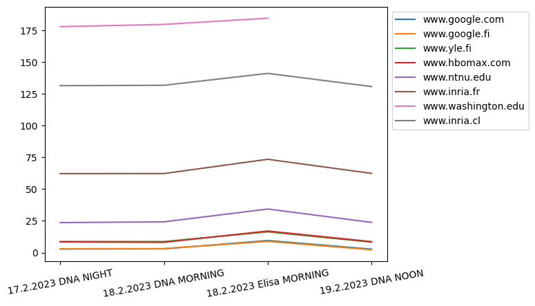
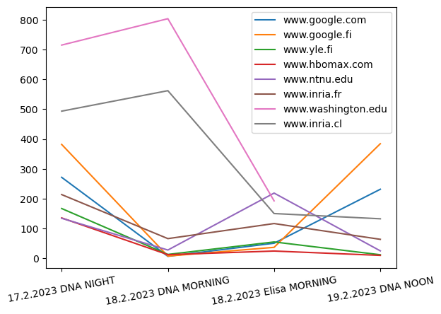
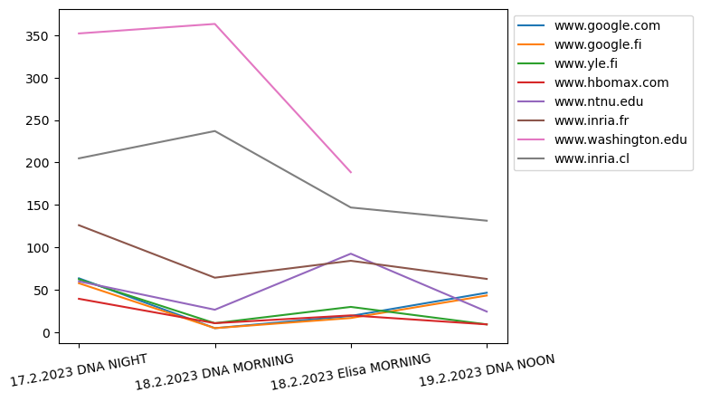
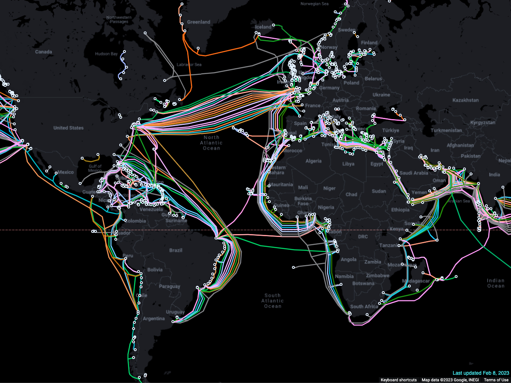

# 1. What is the problem for which the authors are proposing VM based cloudlets?

They want to give mobile devices which limited by resources a real-time interactive response. This method allows mobile devices to connect to high-bandwidth wireless LANs with minimal latency, allowing them to access resources without relying on distant clouds.

# 2. 

We give three figures which shows the min, max, and average delay at 3 different time points and two network conditions.

The three time points are: 17.2.2023 NIGHT, 18.2.2023 MORNING, 19.2.2023 NOON

And we use two network services provider: HOAS network, which is privided by DNA, and the mobile hotpot provided by Elisa.

The washington.edu cannot response our request at 19.2.2023 noon, therefore, there is no data for that.

All three graphs show that latency tends to correlate positively with geographic distance, but Chile appears to be faster than the US.
I checked the submarinecablemap and found no fiber optic cables from Europe to Chile, so I thought it might be because of the heavy network traffic in the United States, which blocked the communication, while the backlog in South America was not serious, so I got a reply faster.

What is more, we found that Google's service is often very fast, followed by yle and hbo, which also shows that Google has done a lot of work in optimizing the search speed. For example, the .com domain name can directly find the nearest server. Thus even faster than the local yle.

And the stability of google.fi is not even as good as google.com, I don't understand why.

Moreover, at the same time, the delay of broadband is smaller than that of mobile hotspots, which may also be due to additional routing.

# 3. 

## a. Does Table 1 contradict the claims of Satyanarayan et al, and Why?  (0.75 points)

The idea that there is only 0.1s latency in 6G does not contradict the claims of the authors.
They believe that latency is a major issue in mobile computing. Moreover, thin clients might deliver a better user experience than standard desktop computers, because of quicker reaction times and more immersive. But the latency between 1ms and 0.1ms does not make lots of difference for a human being. The human reaction time is 0.2s, or 200ms, they cannot distinguish the difference!

## b. If we would like to have an end-to-end latency of 0.1 ms what is the upper bound on the distance between the end-user device and server on which the cloudlet is being spawned?

I did not read discussion about the latency dirctly. Therefore, I think that the latency is depend on the speed of light.

If we assume the speed of light is approximately $3*10^5 km/s$, the maximum distance between the end-user device and server would be $30km$ when we want the latency below $0.1ms = 1*10^{-4}s$.

# 4. Describe the architectural model for the Kimberly system, and state how the components of this system are related to the components of Borg.

The Kimberley system is an architectural model for cloudlet-based, resource-rich, mobile computing. It consists of a mobile device, a cloudlet infrastructure, and a controller called the Kimberley Control Manager (KCM). The KCM is responsible for establishing a secure TCP tunnel between the mobile device and the cloudlet, and for managing service discovery and network management. The components of the Kimberley system are similar to the components of the Borg system, which consists of a master node, a set of worker nodes, and a controller, which responsible for managing resource allocation and scheduling.

