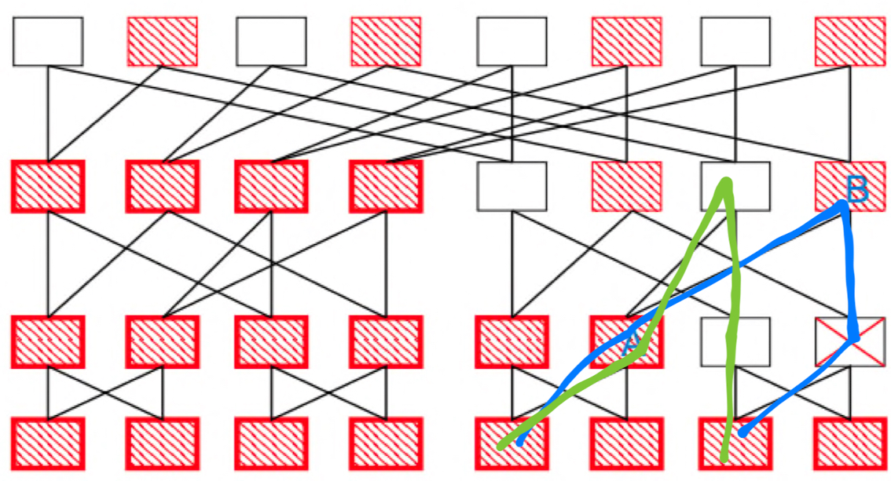
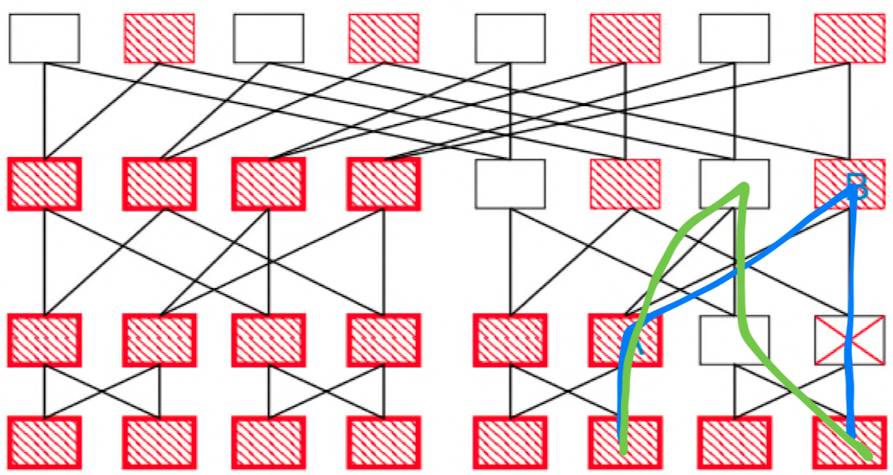
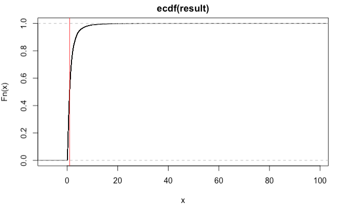

# Q1. What is the problem the authors are attempting to solve? (0.5 points)

Though nowadays people use some approaches to achieve the goal that ensure the fault tolerance, companies will still pursue fault tolerance and fast recovery, especially on server clusters. Authors proposed another approach by combine the design of network, router, and failure detector.

# Q2. What is a FatTree? In terms of data-center networks, what does it imply to have a "Fat" link/branch? (0.5 points)

FatTree is a network architecture which looks like a normal tree, but it is designed higher bandwidth for the top layers and smaller bandwidth for the lower layers. This design is also intuitive, because the upper layers provides much more communication.

For the data-center, a fat link imply that the switch and cable for this layer are high bandwidth, e.g., use fiber or a large bandwidth switch.

# Q3. What is oversubscription? Consider a ToR switch which connects 20 servers each with a 1 Gbps Ethernet link, and has an uplink of 12 Gbps. What is the over-subscription factor of this switch?  (1 point)

In this situation, over-subscription is a term to describe that a up-links will provides services for much more servers this link could serve. For example, if a server communicate to another server with full rate, the ratio is 1:1, however, in the top layer, those servers tend to provide services for much more server, which leads to the incredible result, 1:240. 

The over-subscription factor is $12:20$, which equal to $3:5$.

# Q4. What is the shortcoming of using all the available paths between the source and destination? What are the shortcomings of taking this approach? (1 point)

If we use all available paths, when failure happened we still need to resend the package we lost. Moreover, if we use all paths, we also split the traffic pressure to all physical links, which also let the coordinator cannot adjust the traffic flow or manage the failure as author mentioned. They introduced the methods to keep the load balancing at chapter 6. Some of the methods, e.g., centralized scheduling, will be scheduled together to ensure the balance. If we random send packages or use all possible path, we cannot get this approaches.

# Q5. You are required to enumerate all the paths between switch 9 and switch 12 when using a FatTree topology? (1 point). 

I think the answer should be yes. Because the FatTree will record redundant path to provide alternative solution when failure happens. And the method to get at least one redundant path might be that enumerate all the potential paths.

# Q6. Can you provide an example of a path that traversed switch A and the switched marked as X but now has an alternative path that still traverses switch A? (1 point)

We could find that the blue path passed the A and X before, and the new green path, which starts from the same source, also passed the B and the terminal as same as the blue one.



# Q7. Continuing the previous question. Can you show an example of a path that traversed switch B but for which there is no alternative path that still traverses switch B after the switch marked with X fails. (1 point)?



# Q8. Can you elaborate and explain how can a congestion cause a false positive? (0.5 points)

Yes, of course. My pleasure!

We know that if we use heartbeats to monitor the activity of nodes, we will intuitive classify a node as a 'dead node' if we do not receive any heartbeat. However, we do not receive any thing does not means that the node does not send heartbeat, another possible hypothesis is that heartbeats were blocked on the link when congestion happens. Namely, if congestion will block a link and some nodes use this link to transmit heartbeats, it is easy for us to judge it as invalid.

# Q9. What would the TCP congestion window be if F10 had not recovered and the timeout had occured? How would the red line look if F10 had not recovered? (1 point)

If F10 does not recovered, the congestion window will drop to $1$, then keep $1$ when failure cannot be fixed.

If F10 does not recovered, but there is no timeout, due to the lost of packages, the congestion window will dynamically maintain an appropriate value.

# Q10. The authors use a log-normal distribution to emulate the inter-arrival times and flow ON and OFF intervals. Using a programming language of your choice create a vector of 106
 random numbers sampled from a log-normal distribution with $\mu$=0
 and $\sigma$=1
 and plot the empirical CDF of these samples. Please also provide the 50th percentile of the samples you generated and a pointer to the code? (1 point)

```{r}
result = rlnorm(10e6, 0, 1)
ecdf_result = ecdf(result)
half = quantile(result, 0.5)
print(half)
# if i plot use this code, the pdf will have some weird error, therefore, i paste the screenshot below
# plot(ecdf_result) 
# abline(v=half,col="red")
```


# Q11.  What are the key strengths of this work? (0.5 points)

- By introducing asymmetry, the network topology is optimized to improve performance.
- From the results, the failure recovery performance is also good.
- Test a lot and use data to support their arguments.

# Q12. What are the key weaknesses, and how would you address these weaknesses (1 point). 

The alternative paths could improve the performance. However, it will also lead to another question, how to choose the best path. If we use greedy solution, the link has smallest traffic might be fulled with tons of data.

In my humble opinion, we could assign a random number or a random number plus a ranking number for links a node connected. Then, if there are some failure happens, each node will use the link which have a biggest/smallest number. In this way, if we could find a better algrithm to generate the ranking number, we might have a better solution.


