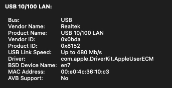

# 1. What is the problem OpenFlow is aiming to solve? (0.5 points)

For network research, medium-scale (like in campus) physics experiments and make changes on network products, like switches, are expensive and unrealistic. However, researcher will have more data and feedback if they could deploy their approaches on the real network. Therefore, authors proposed OpenFlow to enable programmable network on real world without huge replace action and leak of internal workings.

# 2. What do the authors imply by the ossification of the network infrastructure? (0.25 points)

Because any new propose cannot get enough experience from large-scale experiments. We cannot deploy these new approaches in real world due to the lack of confidence. As a result, the infrastructure still maintain the old style and it is hard to improve on infrastructure.

# 3. Continuing on the previous questions, what the pros and cons of ossification of the network infastructure? (0.25 points)

Pros: 
- stable. If the whole environment do not change, these protocols and devices could work for a long time.
- Easy to develop wide acceptance around the world.

Cons:
- lack of adaptability. If the development brings new demands, we have to wait a long time before we meet these needs.
- If it is not backward compatible, it is easy to cause some bad consequences.

# 4. In the Introduction, the authors mention "Existing platforms with specialized hardware for line-rate processing....".
## (a)  What is line rate processing? (0.25 points)

Link rate is the data transmission rate (speed) in a cable. Line rate processing means a processor or devise could handle traffic with the line rate speed, which means they could output/forward/etc. traffic without congestion.

## (b) What is being processed? (0.25 points)

The packages come from different interfaces.

## (c) Why is there a need for specialized hardware (in this context)? (0.25 points)

Because the bandwidth and traffic volume in large-scale data center demands a processor could fit these needs, which leading to cutting-edge line rate processors.

## (d) What is the line-rate of the WiFi/Ethernet interface/link of your device, how? (0.25 points)

WiFi maximum PHY data rate: 1200 Mbps

From: [MacBook Pro Wi-Fi specification details](https://support.apple.com/guide/deployment/macbook-pro-wi-fi-specification-details-dep2ac3e3b51/web)

USB:

# 5. In Section 2, the authors mention that "a packet header defines the flow". Can you give an example of a flow that satisfies this definition? (0.5 points)

My computer sends a package to the server in the university. The router in my room will inspect the header of the package, then they will choose which router is next hop. This step will repeat for several times, then the package will get to the destination.

From this example, we can find that the only thing (from the packet itself) impact to the path choice is the packet header. Therefore, we could say, the header defines the flow.

# 6. Continuing on the previous question, the authors state "each header field can be a wildcard to allow aggregation of flows."
## (a) Can you give an example of a wild card? (0.25 points)

`*` means any character(s). For example, `*.pdf` will match any pdf file, which ends with `.pdf`.

Subnet mask also could be considered as wildcard. For 192.168.0.0, its mask is 255.255.0.0, which means the last 16 bits could be any character.

## (b) What is the need for aggregation of the flows? (0.25 points)

I think using aggregation could save some control data, like the header and tail. Moreover, maybe some compression technology also could be applied on them.

# 7. In the example discussion in Section 3, "When her packets reach a controller, her new protocol chooses a route and adds a new flow-entry (for the application flow) to every switch along the chosen path." 
## (a) Does this imply that the controller manages (controls) all the switches in the path? (0.25 points)

We cannot say the controller controls all the switches, but the controller tell switches which support OpenFlow how to deal with some specific packages.

The low-level function in switches the controller cannot manage/control.

## (b) What happens if the controller goes down?  (0.25 points)

The Ethane prototype could handle the failure of controller. They have cold-standby (no network binding) and warm-standby (with network binding) to take over the role of controller.

# 8.What are the various steps required to ensure allow a client in the wireless network (say your phone) discover and use the services deployed on a server in the server room (wired network). (1.5 points)

1. distribute a network address pool for devices in the wireless network.
2. config a flow rule to the switches for the traffic come from the address pool in Amy-OSPF.
3. deploy this algorithm on OpenFlow controller.
4. The flow will be established with Amy-OSPF

