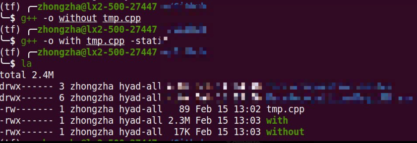

# 1. What is the problem the authors are aiming to solve in this article? (0.5 point)

Nowadays, more and more data centers were used among the world. However, how to control and manage machines and tasks over several clusters effectively and efficiently still a problem, especially when encountering a failure.

# 2. What is a diurnal usage pattern? Can you provide one example (0.5 points)

Diurnal usage pattern indicates that some requests or resources usage have a one-day-long cycle. For example, a student may log Moodle at 9.00 to download slides, which leads to a usage peak. Then, about 12.00, students might go for lunch, as a result, the load will be slightly reduced. Then, afternoon, students download matriials again. After dinner, may some students are trying to catch the due, and there might be another peak. At the midnight, everyone will sleep, the load will be a valley.

# 3. The following contains a snippet of a C++ program. Can you compile the code and provide the size of the binary with 
1. static linking and then 
2. without static linking? 

What is the reason for the size difference? (0.5 points)

```{C++}
# include <iostream>
int main() {
std::cout << "Hello World" << std::endl;
return 0;
}
```



It is because if we use static linking, we will compile what this program need in the executable file. As a result, the size will be much bigger because it contains everything we include in source code.

# 4. Please describe Figure 1 in 5-10 sentences (2.5 points)

A Borg unit (cell) is managed by a controller, named BorgMaster, which includes the master itself and a scheduler and have five copies. 

There is a local agent process, named Borglet, which aimed to managed the machine to operate tasks. 

The scheduler will distribute tasks to a machine which are able to run this task in descending order of priority. 

The master controls the communication to Borglets to check the status to improve the scalability by maintaining a stateless link shard which run on a copy of master.

Moreover, Paxos provides highly-available, distributed, persistent storage for the master, e.g., they save the logs on Paxos.

The BordMaster also have a read/UI shard to support *outer control*, like web browsers, command-line tools and borgcfg.

# 5. Describe Figure 5 (b) and explain why are we seeing steps in the CDF and what do the error bars represent? (1.5 points)

If we want to separate tasks on 15 units, we may need more and more extra machines with the increase of overhead.

The reason why we could see steps is that with some machines involved in working, the capability also increased. However, some tasks and their overhead cannot infinite subdivided. Therefore, the new overhead needs a certain number of new machines to support. But if we introduce more machine, there will be some 'fault tolerance' to allow some overhead.

The error bar indicates that the range how much the overhead is when new machines are needed.

# 6. What is a milli-core? (0.5 points)

Milli-cores is a unit to describe the CPU usage. The calculation method is that people divides one core of CPU into 1000 parts, and each of them are a milli-core.

# 7. Summarize the results of Section 5 in 5-6 sentences. Please describe which subset of results you picked and why?(2 points)

To make use of different machines, they randomly remove extra machines until the cell cannot support the task, meanwhile, the overhead of subdivision also be considered.

Because the productive tasks tend to reserve some resource for preparing the workload peak, Borg will reclaim resources and share them.

It is feasible to build large units, and this method also increase the resource utilization.

The sharing strategy does not increase the cost significantly, and enables the share of all other resources.

The control of Borg is fine-grained, due to the lack of best size of bucketed.

Borg uses the elastic resource allocation method, which will predict the usage of resources and dynamic adjust them.

I pick each subsection in section 5. But I think the discussion of 5.3 is covered by others.

# 8. How can Borg use the results of OpenFlow, F10, and VXLans? (1 point)

If some engineers want to try their new protocols, Google could buy switches support OpenFlow to enable easy test and debug.

F10 gives a fault tolerance and fast recovery network for a big data center, which also could increase the availability.

VXLans also enables the large-scale virtual subnet in data center, which could increase the scalability (Google definitely need a better scalability solution).

# 9. What are the key weaknesses of this work in your opinion, and how would you address them? (1 point)

The size allocation of the unit does not feel *smart* enough.

I may use histroy data, and its periodicity, combined with the results of the test. I may use some math tools, e.g., Kalman filter, to complete the allocation.


