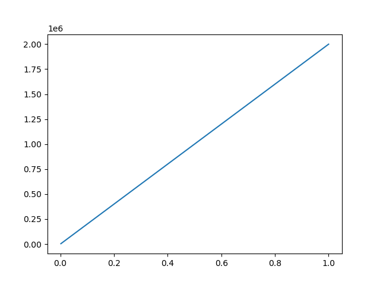
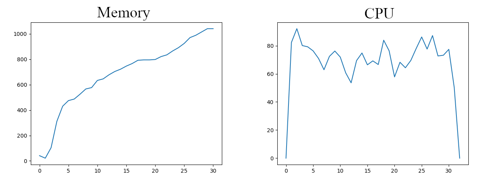

# 1. Availability (0.5 points) 

[Github Link: https://github.com/Linzh7/CSM13103-Cloud-and-Edge-Computing/tree/main/P1-MatrixMultiplication](https://github.com/Linzh7/CSM13103-Cloud-and-Edge-Computing/tree/main/P1-MatrixMultiplication)

# 2. Progamming Language and Libraries (0.5 points)

I use Python as my programming language. 

Moreover, I use the NumPy library to compute the results, Matplotlib to plot the histogram of the results, a memory-profiler to record the memory usage of codes, and multiprocessing to record the CPU usage.

# 3. Methodology (2 points)

## 3.1 Creation and compution method

The shape of $A, B, C$ is $(10^6, 10^3), (10^3, 10^6), (10^6, 10^1)$. We use `np.random.rand(X, Y)` to create it, where $X, Y$ are the parameters of shape.

What we need to do is computing the result of $A*B*C$. However, if we compute it directly, we will find that we cannot have enough space to store the result of $A*B$, whose shape is $(10^6, 10^6)$ and it will occupy about $8,000 GB$ (when using double to storage). Therefore, we should use basic linear algebra knowledge to simplify the computing.

Therefore, we should compute the result of $B*C$ at first, then get the result of $A*(B*C)$. In this way, the maximum intermediate result will only be $8 MB$ (also when in double), while the matrices $A, B$ are about $80 MB$.

## 3.2 Resources recording method

We will analyze the result using the mathematical method described above, and we will also use a library to record CPU and memory usage. However, because my laptop manages memory usage automatically, I cannot provide optimal performance results. Therefore, you might also see some weird results by running my code if your workstation does not have enough memory.

However, the libraries I use will plot the usage just fine. The plots could be analyzed at the following chapter.

# 4. Dataset (2 points)

As the Fig. 1 shows, we would say that the $np.random.rand()$ is obey the uniform distribution. That is why the curve is a straight line.

{width=50%}


# 5. Evaluation (2 points)

As we can see, the $memory_profiler$ shows that the maximum memory usage is about $112 MB$. However, this result might not correct. And the reason is talked above.

```
Line #    Mem usage    Increment  Occurrences   Line Contents
=============================================================
    20    112.0 MiB    112.0 MiB           1   @profile
    21                                         def compute():
    22                                             # step 1
    23     67.0 MiB    -44.9 MiB           1       BC = np.dot(get_B(), get_C())
    24                                             # step 2
    25     67.2 MiB      0.1 MiB           1       return np.dot(get_A(), BC)
```

Also, we could plot the memory and CPU usage as Fig. 2.

{width=80%}

We can conclude that Python does not delete the matrix $A, B$ from memory during the entire processing stage. Moreover, the CPU usage is close to 100 percent during the processing stage, which means the processor was working on the data, and this task is a computing-intensive one. However, there are still times when utilization is only 60 to 80 percent. This could imply that the IO is the program's bottleneck.

# 6. Discussion (3 points)

The biggest challenge for me is how to convert the original question. As we know, if we compute the result in the left-to-right flow, we will face a huge intermediate result. However, if we use the **associativity** of matrix multiplication, the complexity of computing will be reduced a lot, as we discussed above.

Additionally, another problem I face is that how to monitor the CPU and memory usage. Because Python is a high-level programming language, it is a little bit hard for me to record these usage in my program. However, I find the Python provides functions to monitor the resources of its sub-process. Thus, I use these function to achieve this goal.

Moreover, the step by step analyze might have some error, it might be caused by the system memory manage function, which will store some data in memory into disk when the available memory is low.

For mathematics computing, we have to be engineers who are capable of solving some problems related to storage space, computing time, and approximation.


